# FPW_Final

# Account info:
admin:admin

test_service:123qwezxc

test_manager:123qwezxc

## Главная
http://127.0.0.1:8000/
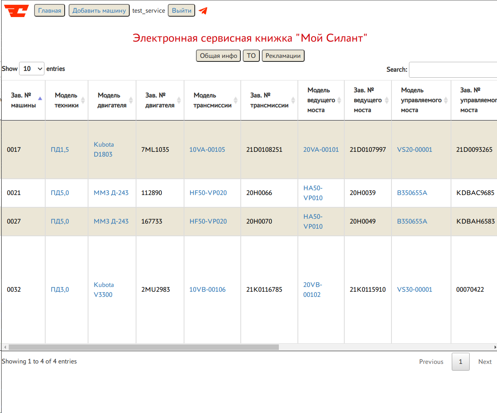

## Поиск по заводскому номеру
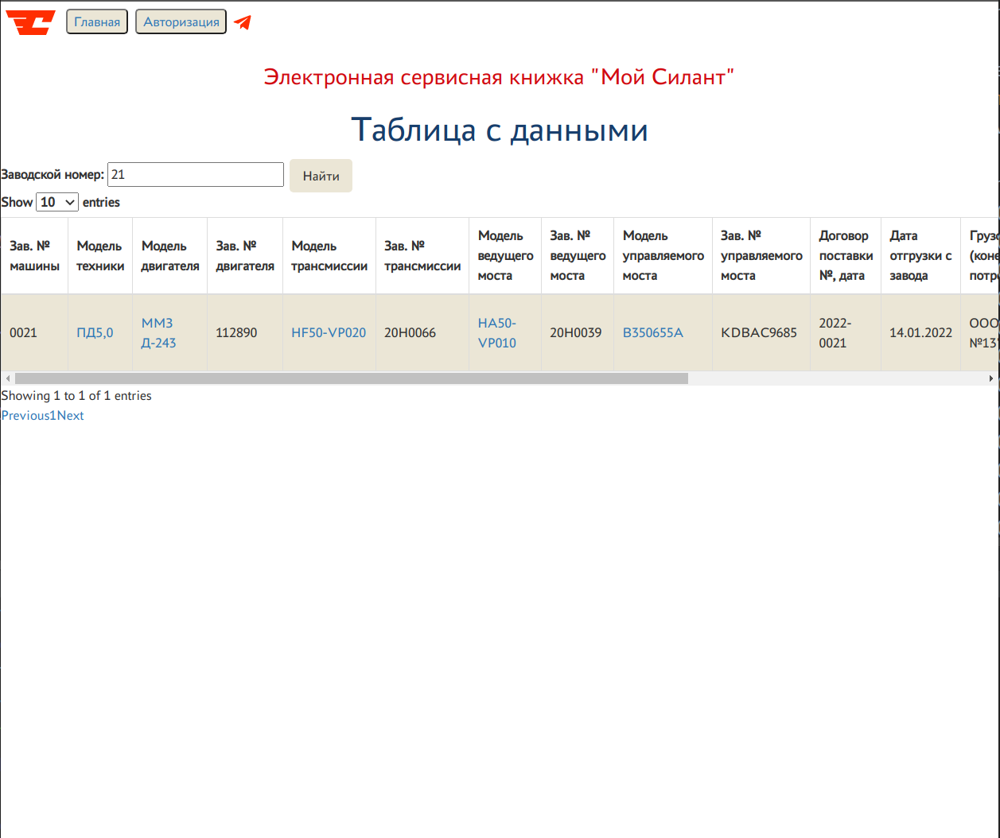

## Страница авторизации
http://127.0.0.1:8000/login/
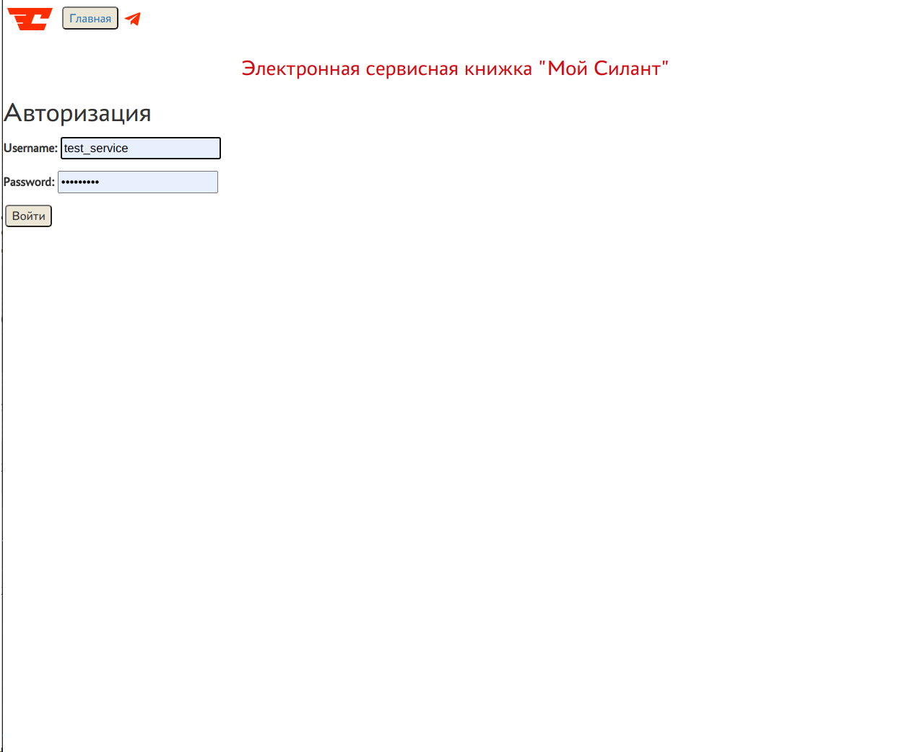

## Главная страница для авторизованного пользователя. Вкладка «Общая инфо»
http://127.0.0.1:8000/auth_index/

## Вкладка «ТО»
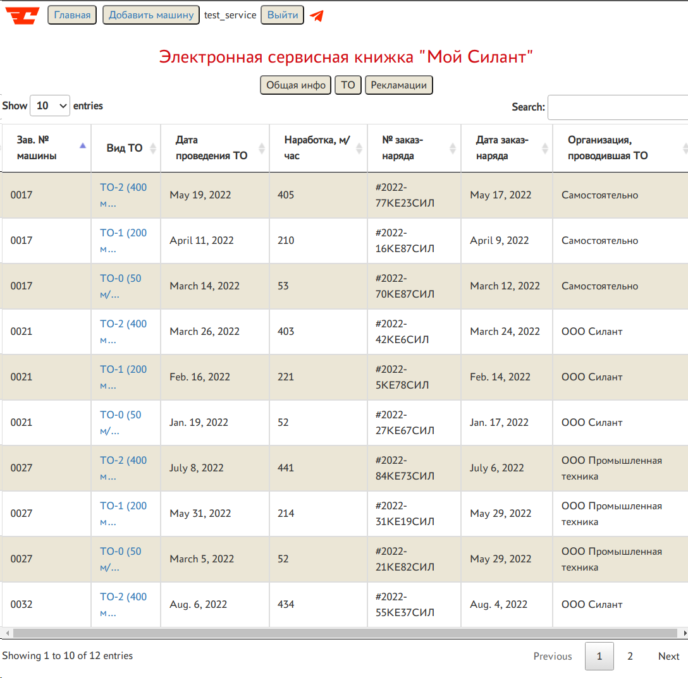

## Вкладка «Рекламации»
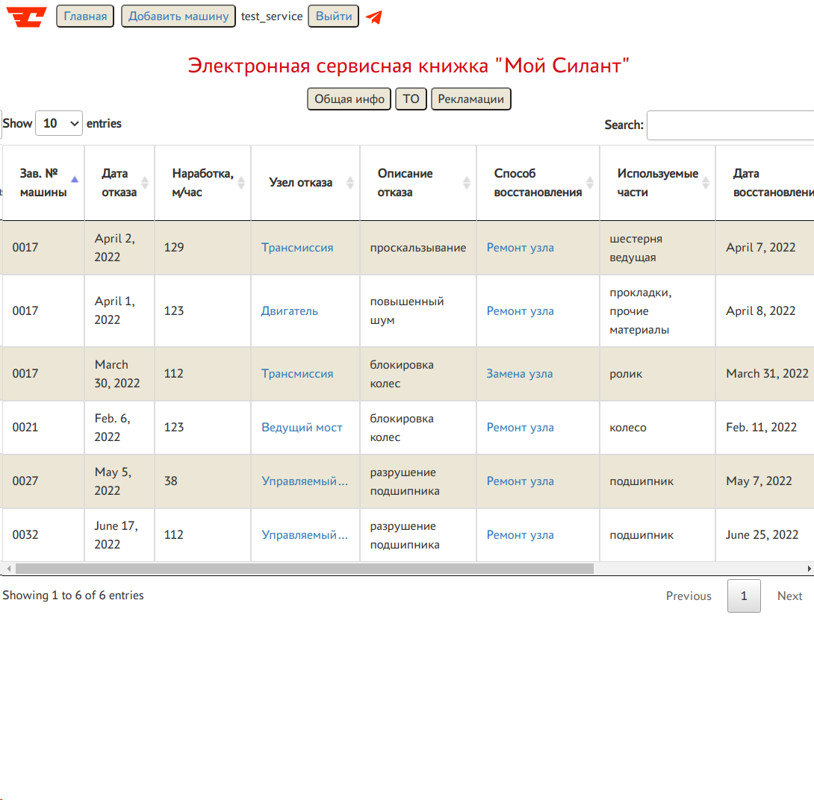

## Справочник «Модель техники»
http://127.0.0.1:8000/vehicle_serial_number/1
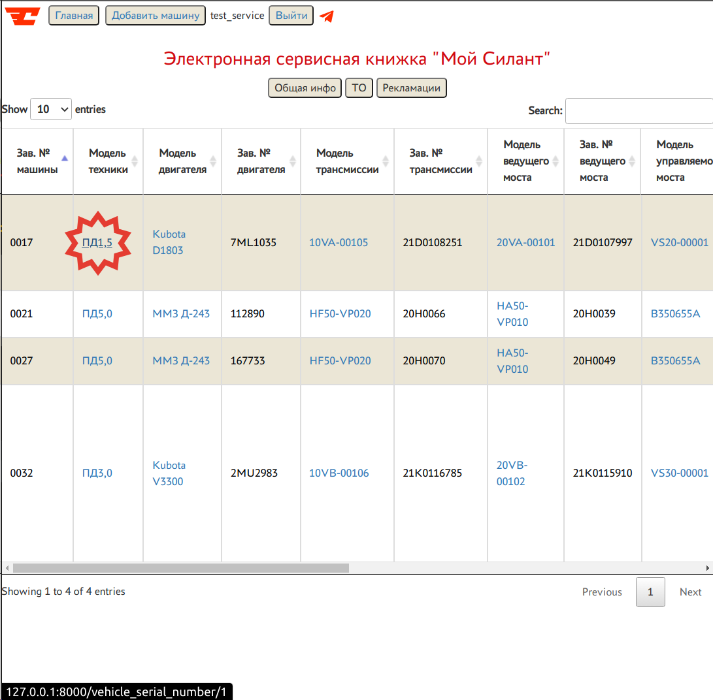
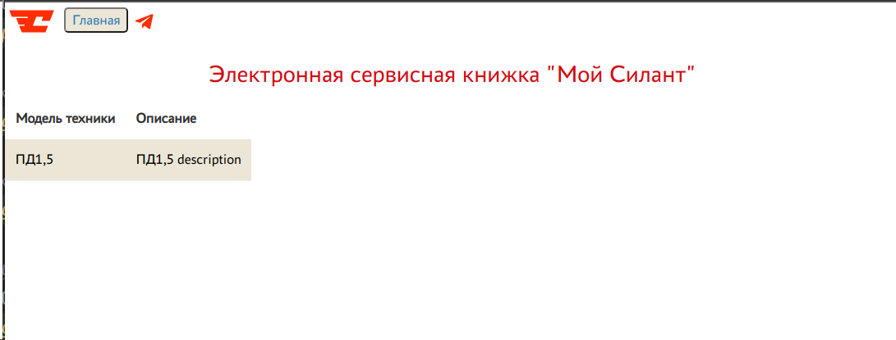
## Получение данных по URL 
http://127.0.0.1:8000/vehicle/1/
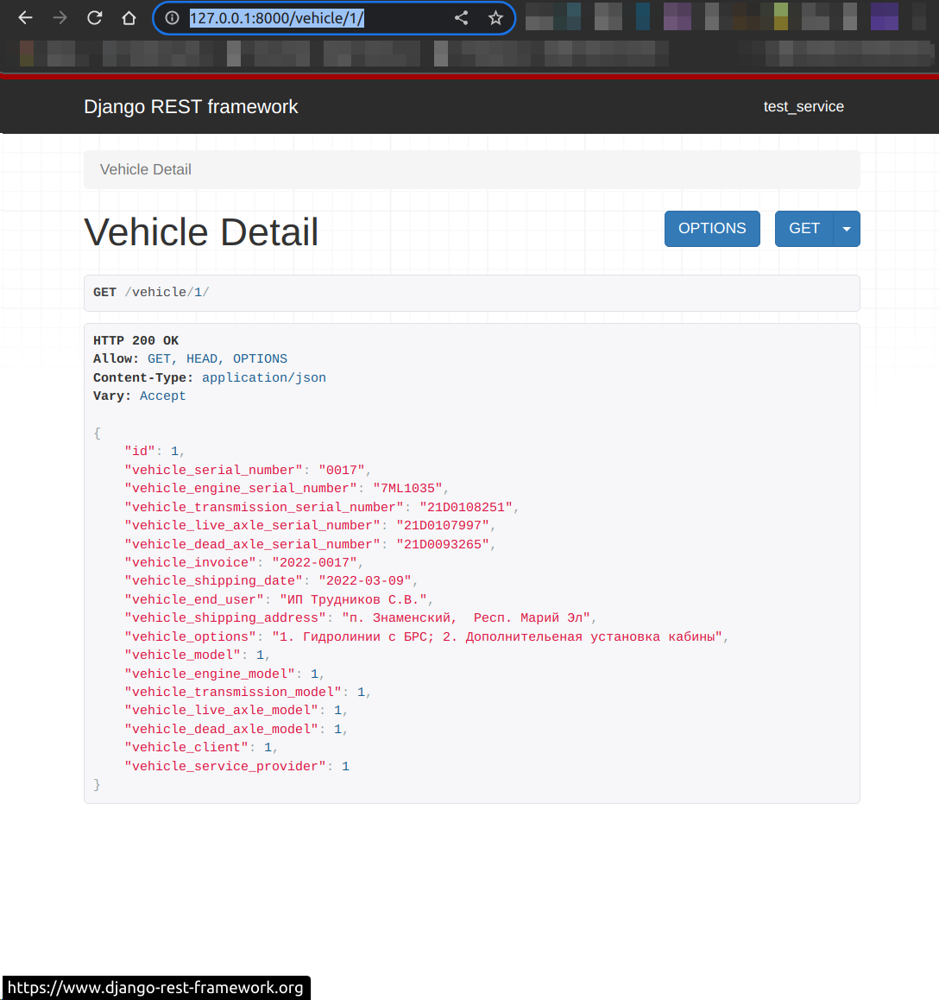

## Добавление записи о машине
http://127.0.0.1:8000/create/
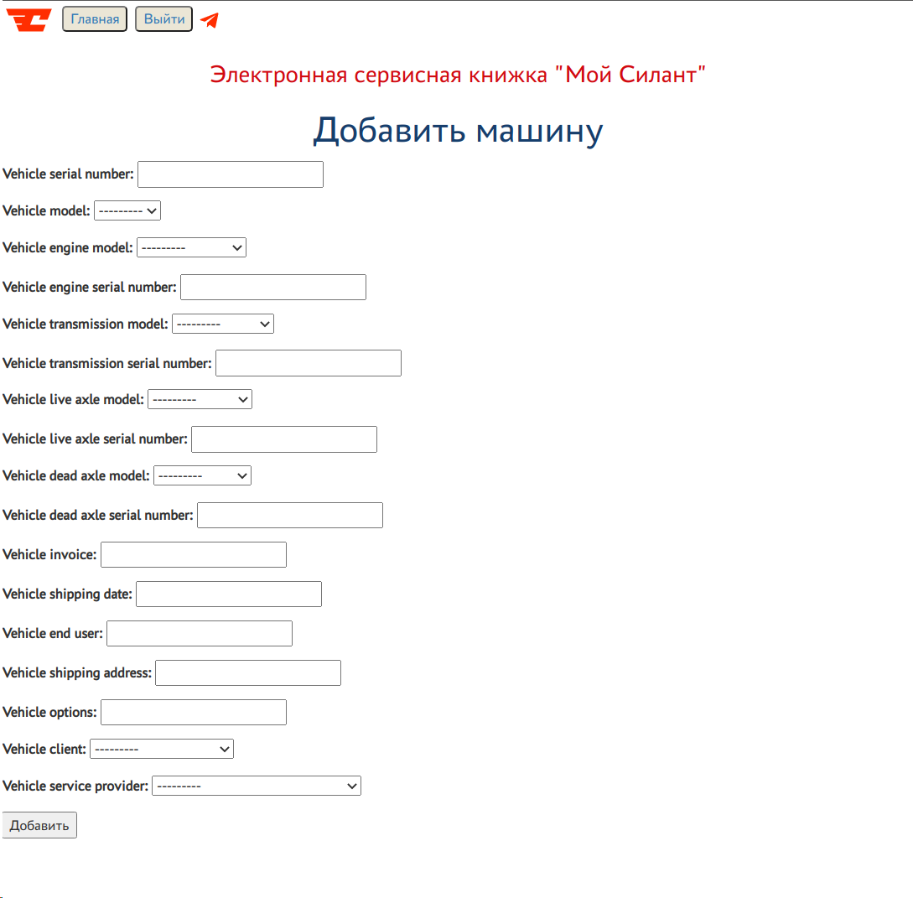

## Изменение записи о машине
http://127.0.0.1:8000/vehicle/1/update/
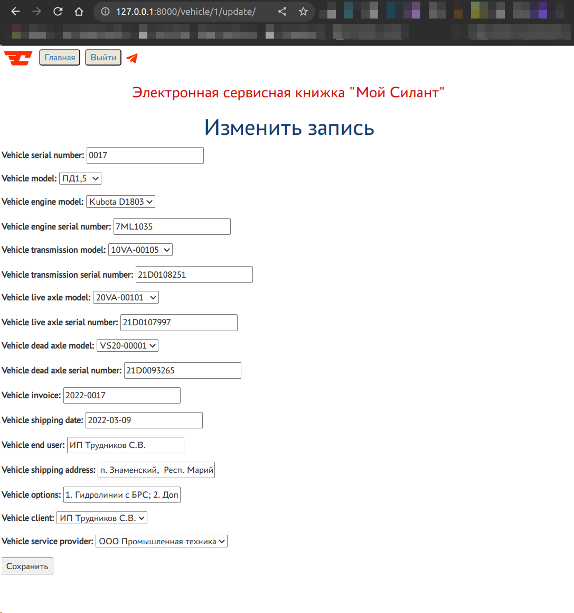

## Удаление записи о машине
http://127.0.0.1:8000/vehicle/1/delete/
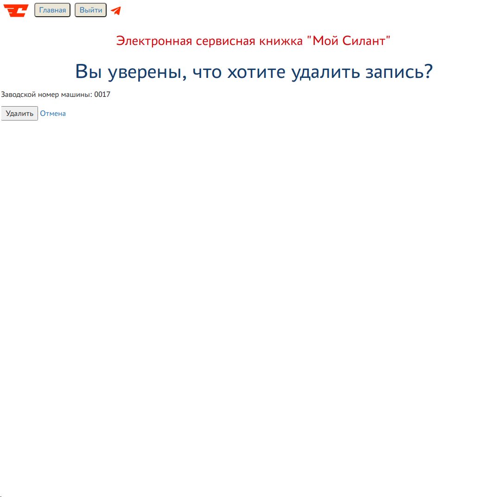